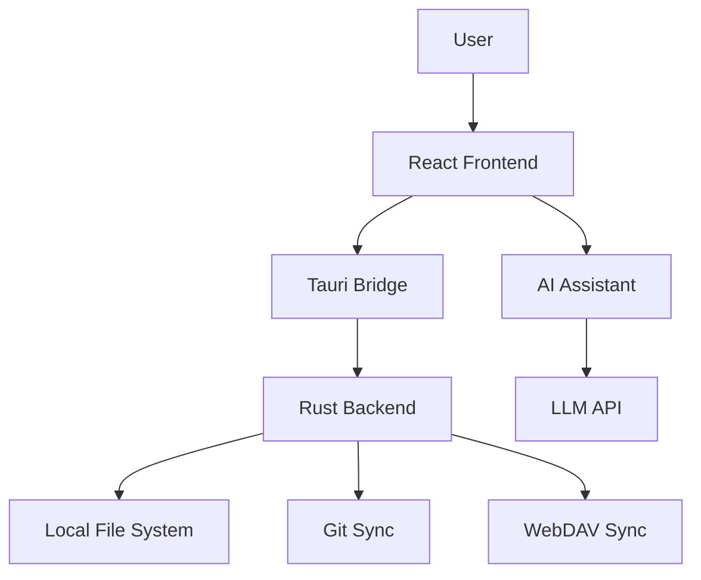

# Project Plan: ThinkingKity v1.0

## Overview

Build a local-first knowledge base with vault-based file management, multi-format editing, and an integrated AI assistant.

## Milestones

| Milestone | Target | Status |
|-----------|--------|--------|
| Core editing (Markdown, Code, CSV) | Apr 2026 | Done |
| File tree & vault system | Apr 2026 | Done |
| AI assistant integration | May 2026 | Done |
| Vault sync (Git + WebDAV) | May 2026 | In Progress |
| Mobile companion app | Jun 2026 | Planned |
| Plugin system | Jul 2026 | Planned |

## Architecture

## Risks & Mitigations

| Risk | Impact | Mitigation |
|------|--------|------------|
| File sync conflicts | High | Pull-before-push, local precedence |
| Large vault performance | Medium | Lazy loading, incremental indexing |
| API key exposure | High | Local-only storage, no cloud transmission |

## Next Steps

1. Complete Git sync end-to-end testing
2. Implement WebDAV backend
3. Add conflict resolution UI for pull failures
4. Write integration tests for the sync module
